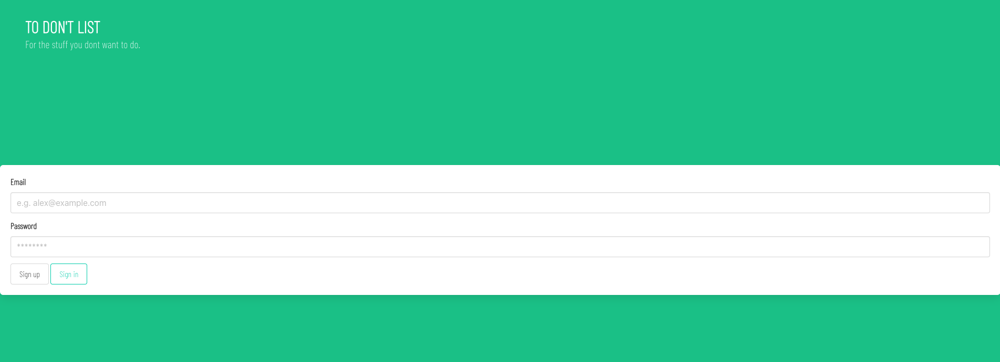
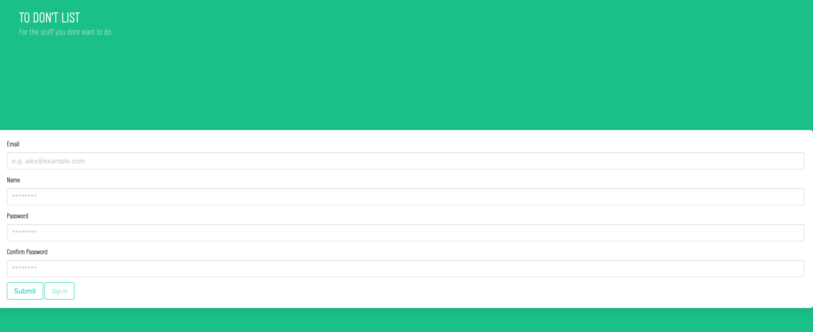
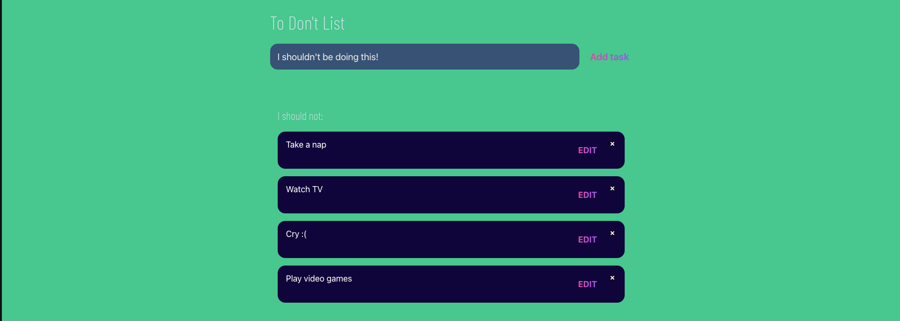

# To Don't List - Project 2

## Table of Contents
- [Project Description](#project-description)
- [Installation Instructions](#installation-instructions)
- [Usage Information](#usage-information)
- [Questions?](#questions)

## Project Description
This project was created to demonstrate our ability to intigrate front end, back end and a database. This project lets you keep in mind and create a list of bad habits or things that you want to keep in mind not to do when you are focusing on a task of highly importance.

## Installation Instructions
Login into MySQL, and source schema.sql.
Open the command line, type "npm run seed", press enter.
Type "npm start", press enter.
Head to the log in page (http://localhost:3001/routes/api/login)
If you are not an user, click the sign up button or head to the registry page (http://localhost:3001/routes/api/register)
After that head to the main dashboard to create your list (http://localhost:3001/routes/api/dash)

## Usage Information
Once you are in the main page, your dashboard, use the buttons provided to add, edit and delete items from your list. Enjoy

## Questions?
Here is my GitHub Profile: [pargasparedes](https://github.com/pargasparedes)

## Screenshots

